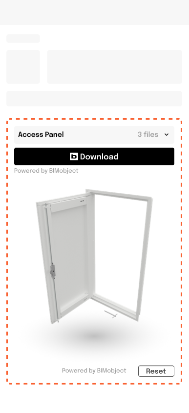
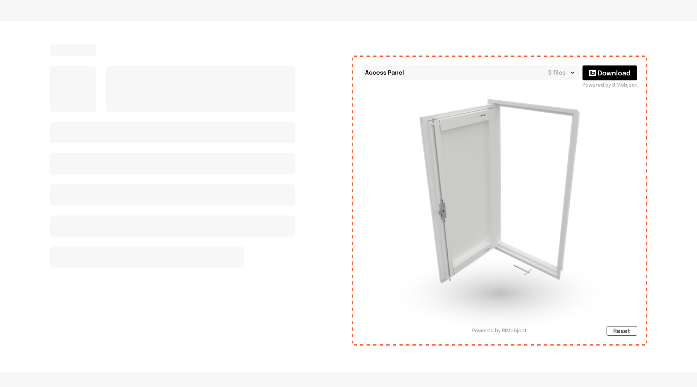

# 3d preview

Empower your site with 3D BIMobject previews using our iframe solution. Please find documentation and guides to effortlessly integrate our 3D viewer iframe solution into your website or application.

## Get Iframe Url

1. Call the endpoint with the GTIN of the product you want to preview.
2. The response will contain the **iframeUrl** of the product and the **expirationDate**.

Please honour the **expirationDate** in the response. Do not use the url after its expiration to avoid having broken links on you site.

If the **preview** element in the response is empty that means the requested product does not have any 3d preview.

### Endpoint

```
/v1/products/by-gtin/{gtin}
```

### Code example

<details><summary>bash</summary>

- Include the token in an authorization header. `Authorization: Bearer {access_token}`

```bash
curl -H "Authorization: Bearer XXXXX" https://embed-api.bimobject.com/v1/products/by-gtin/XXXXX
```

</details>

<details><summary>JS</summary>

- Include the token in an authorization header. `Authorization: Bearer {access_token}`

```javascript
const response = await fetch(
  `https://embed-api.bimobject.com/v1/products/by-gtin/${gtin}`,
  {
    headers: {
      Authorization: `Bearer ${clientCredentialsToken}`,
    },
  }
);
```

</details>

### Response example

```json
{
  "preview": {
    "iframeUrl": "https://embed.bimobject.com/preview/{productId}?clientId={clientId}",
    "expirationDate": "2023-11-24T10:03:01.8878558+00:00"
  },
  "files": [
    {
      "id": "6e649a4f-4b28-416d-90d6-68cf1b010076",
      "fileType": {
        "id": "85ea1736-77c4-4c22-88e9-fb83788fc64a",
        "name": "Revit"
      },
      "name": "Red Car.rfa",
      "description": "",
      "languageCode": "sv",
      "downloadLink": {
        "url": "https://embed.bimobject.com/download/{productId}/{fileId}?clientId={clientId}",
        "expirationDate": "2023-11-24T10:03:01.9188341+00:00"
      }
    }
  ]
}
```

## Embed the Iframe

If the response have a **iframeUrl** you can now embed it on your site using an html iframe tag.

```html
<iframe class="preview" src="{url}"></iframe>
```

### Styling

```css
.preview {
  border: none;
  width: 100%;
  height: 700px;
}
```

<details><summary>Mobile style guide</summary>


<br>

</details>

<details><summary>Desktop style guide</summary>


<br>

</details>
