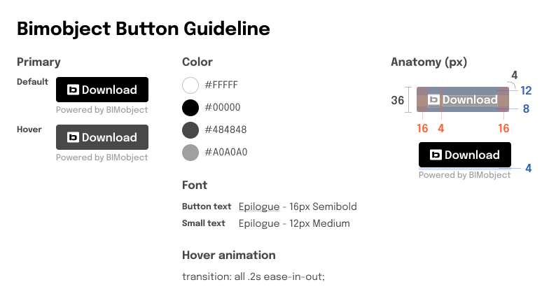
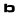

# File download

Dive into our documentation on how to integrate BIMobject file fetching and downloads into your website. Including design guidelines and UI elements, crafted to ensure a seamless user experience.

## Get Download Urls

1. Call the endpoint with the GTIN of the product you want the files from.
2. The response will contain a list of files for the requested product.
   1. The files will have information about the file. It will also have a download link.
   2. This link can be embedded on your site following the instructions below.

### Endpoint

```
/v1/products/by-gtin/{gtin}
```

### Code example

```javascript
// JavaScript
const response = await fetch(
  `https://embed-api.bimobject.com/v1/products/by-gtin/${gtin}`,
  {
    headers: {
      Authorization: `Bearer ${clientCredentialsToken}`,
    },
  }
);
```

### Response example

```json
{
  "preview": {
    "iframeUrl": "https://embed.bimobject.com/preview/{productId}?clientId={clientId}",
    "expirationDate": "2023-11-24T10:03:01.8878558+00:00"
  },
  "files": [
    {
      "id": "6e649a4f-4b28-416d-90d6-68cf1b010076",
      "fileType": {
        "id": "85ea1736-77c4-4c22-88e9-fb83788fc64a",
        "name": "Revit"
      },
      "name": "Red Car.rfa",
      "description": "",
      "languageCode": "sv",
      "downloadLink": {
        "url": "https://embed.bimobject.com/download/{productId}/{fileId}?clientId={clientId}",
        "expirationDate": "2023-11-24T10:03:01.9188341+00:00"
      }
    }
  ]
}
```

## Embed Download Urls

### Link to download

Inside an anchor tag, set the href attribute to the url provided by the API, and the target attribute to \_blank

```html
<div>
  <a class="bim-button" href="{url}" target="_blank" download
    >Download</a
  >
  <span class="bim-text">Powered by BIMobject</span>
</div>
```

### BIMobject style guide for download links

For BIMobject links, including the download link, please use BIMobject styling.



#### Icon

Download BIMobject icon <a href="../../assets/icons/bimobject-logo.svg">here</a>.



#### BIMobject button

<details><summary>Mobile css</summary>
<br>

<br>

```css
.bim-button {
  display: flex;
  justify-content: center;
  align-items: center;
  gap: 0.5rem;
  background-color: #000;
  border: 1px solid #000;
  border-radius: 0.25rem;
  color: #fff;
  cursor: pointer;
  min-height: 36px;
  padding: 0 0.5rem;
  min-width: 132px;
  width: 100%;
  text-decoration: none;
}

.bim-button:hover {
  background-color: #484848;
  border: 1px solid #484848;
}

.bim-text {
  color: #a0a0a0;
  font-size: 0.75rem;
  font-weight: 500;
}
```

</details>

<details><summary>Desktop css</summary>
<br>
The only difference from the mobile button is the width.
<br><br>

<br>

```css
.bim-button {
  display: flex;
  justify-content: center;
  align-items: center;
  gap: 0.5rem;
  background-color: #000;
  border: 1px solid #000;
  border-radius: 0.25rem;
  color: #fff;
  cursor: pointer;
  min-height: 36px;
  padding: 0 0.5rem;
  min-width: 132px;
  width: max-content;
  text-decoration: none;
}

.bim-button:hover {
  background-color: #484848;
  border: 1px solid #484848;
}

.bim-text {
  color: #a0a0a0;
  font-size: 0.75rem;
  font-weight: 500;
}
```

</details>
